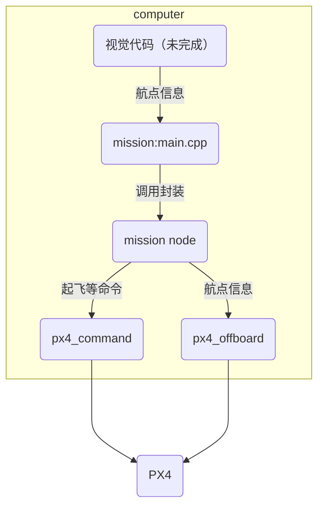

这是一个控制四旋翼无人机航点飞行的代码
# 使用的技术栈

```mermaid
graph TD
    subgraph computer
        B(视觉代码（未完成）) --航点信息--> F(mission:main.cpp)
        F --调用封装--> A(mission node)
        A --起飞等命令--> C(px4_command)
        A --航点信息--> D(px4_offboard)
    end
    C ---> E(PX4)
    D ---> E
```
